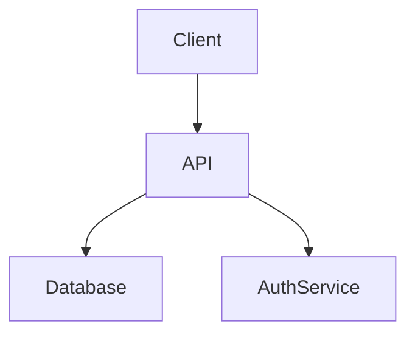

# Documentation Guidelines

Proper documentation is essential for the maintainability, scalability, and onboarding of any project. This guide provides best practices and recommendations for writing, organizing, and maintaining internal documentation for LearnScape.

---

## 1. General Principles

- **Clarity:** Write documentation as if the reader has no prior context.
- **Consistency:** Use the same terminology and structure throughout all documents.
- **Accessibility:** Store documentation in the `/docs` folder and keep it up to date.
- **Versioning:** Update documentation alongside code changes.

---

## 2. Recommended Structure

- `README.md` – Project overview, folder structure, quick start
- `DEV_GUIDELINES.md` – Development workflow, code style, conventions
- `DOCUMENTATION_GUIDELINES.md` – This file: how to document
- `API_REFERENCE.md` – API endpoints, request/response examples
- `ARCHITECTURE.md` – System architecture, diagrams, data flow
- `CHANGELOG.md` – Release notes, major changes
- `CONTRIBUTING.md` – How to contribute, PR process, code review

---

## 3. Best Practices

- **Use Markdown:** Prefer `.md` files for readability and GitHub compatibility.
- **Keep it concise:** Avoid unnecessary verbosity; use bullet points and tables.
- **Update regularly:** Documentation should evolve with the codebase.
- **Link related docs:** Use relative links to connect related documents.
- **Visual aids:** Include diagrams, flowcharts, and screenshots where helpful.
- **Templates:** Use templates for recurring document types (see below).

---

## 4. Useful Tools

- [draw.io](https://draw.io) or [diagrams.net](https://diagrams.net) for diagrams
- [Mermaid](https://mermaid-js.github.io/) for code-based diagrams in Markdown
- [Typora](https://typora.io/) or [MarkText](https://marktext.app/) for Markdown editing
- [Swagger](https://swagger.io/) or [Redoc](https://redocly.com/) for API documentation

---

## 5. Example Templates

### API Endpoint

```
### POST /api/auth/login

**Description:** Authenticate user and return JWT token.

**Request Body:**
```
{
  "email": "user@example.com",
  "password": "string"
}
```

**Response:**
```
{
  "token": "jwt-token-string"
}
```

**Errors:**
- 401 Unauthorized – Invalid credentials
```

### Architecture Diagram

```

```

---

## 6. Collaboration Tips

- Review documentation in pull requests.
- Assign responsibility for keeping docs up to date.
- Encourage all contributors to improve documentation.

---

## 7. Further Reading

- [Diátaxis Documentation Framework](https://diataxis.fr/)
- [Write the Docs](https://www.writethedocs.org/)
- [Google Technical Writing Guidelines](https://developers.google.com/tech-writing) 